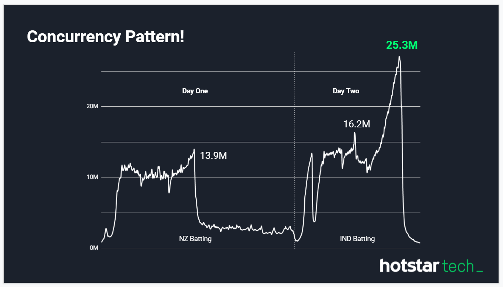
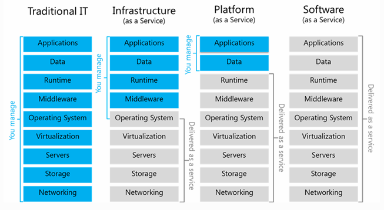

# AWS Cloud Essentials Overview

## Agenda

1. Basic overview of Cloud

1. Quick Demo of the Cloud (detailed explanation later) **

1. Different types of Cloud models and Cloud services

1. Different vendors of Cloud implementations

1. Features of AWS and Managed services offerings

1. Why to Choose AWS?

1. Who is choosing AWS (Customers)?

1. Real time use cases

1. Opportunities in the Cloud / Market

# Further Reading

1. Scaling hotstar.com for 25 million concurrent viewers

    

    - https://www.youtube.com/watch?v=QjvyiyH4rr0  
    - https://docs.google.com/presentation/d/1IYLsySe_thA6qeztnL4Tmhszdu2Wd5-3CKKLm26m-9Y/edit?usp=sharing (Slides for above)
    - https://www.youtube.com/watch?v=2qYR78U4eNQ

1. Cloud spending outstrips on-premises investments for the first time
    - https://www.infoworld.com/article/3612769/cloud-spending-outstrips-on-premises-investments-for-the-first-time.html

1. Community cloud
    - https://www.ibm.com/blogs/cloud-computing/2015/09/02/community-cloud-the-answer-to-the-publicprivate-debate/
    - https://baadal.iitd.ac.in/baadal

1. Cloud Service Models  
    

